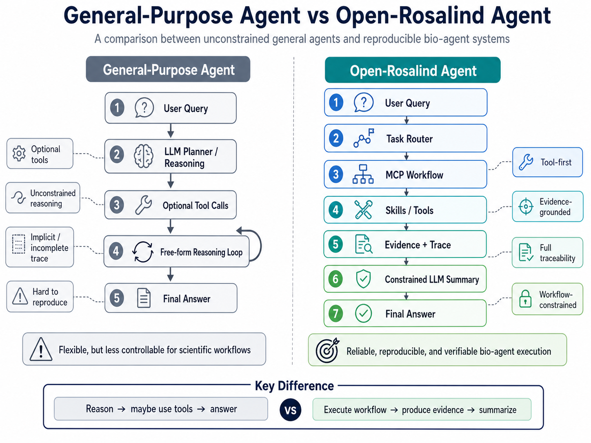
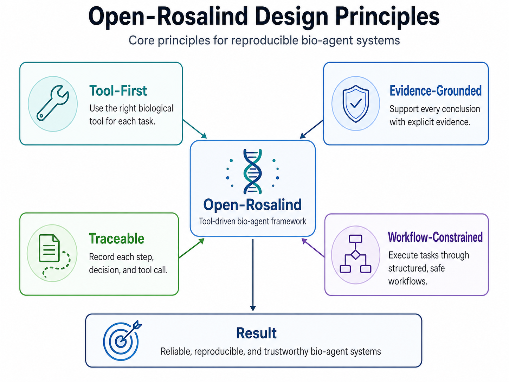
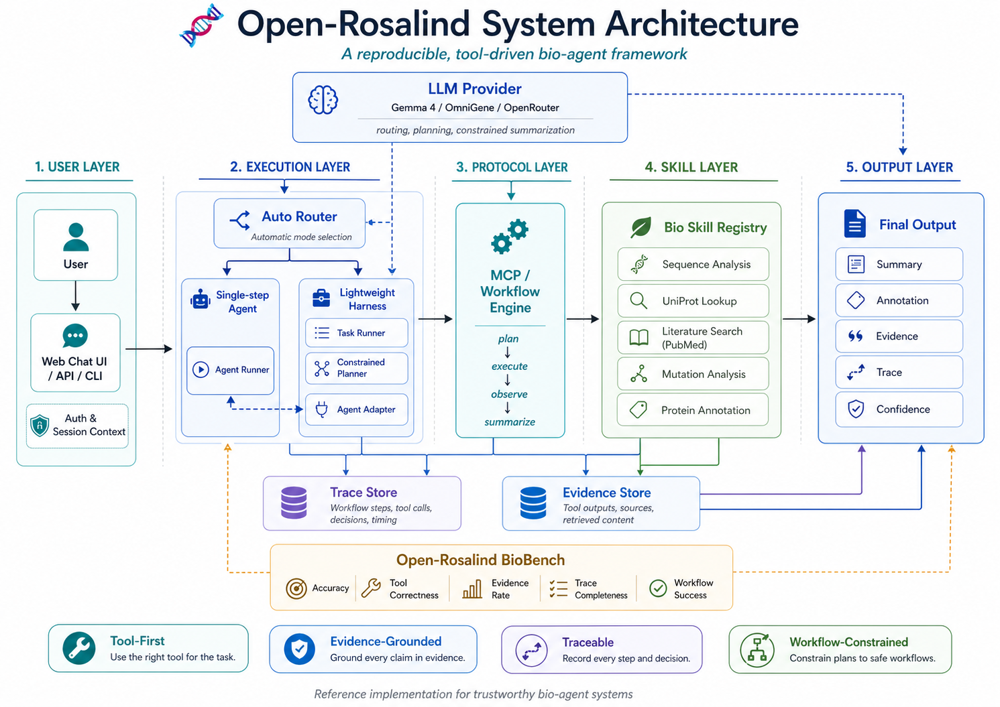
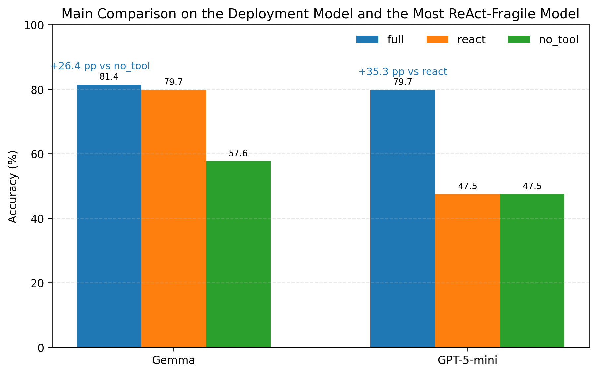
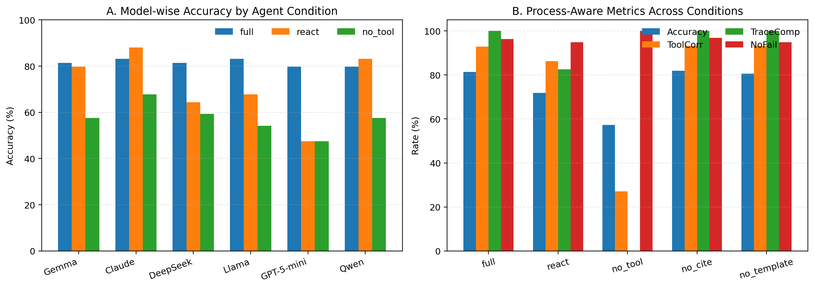
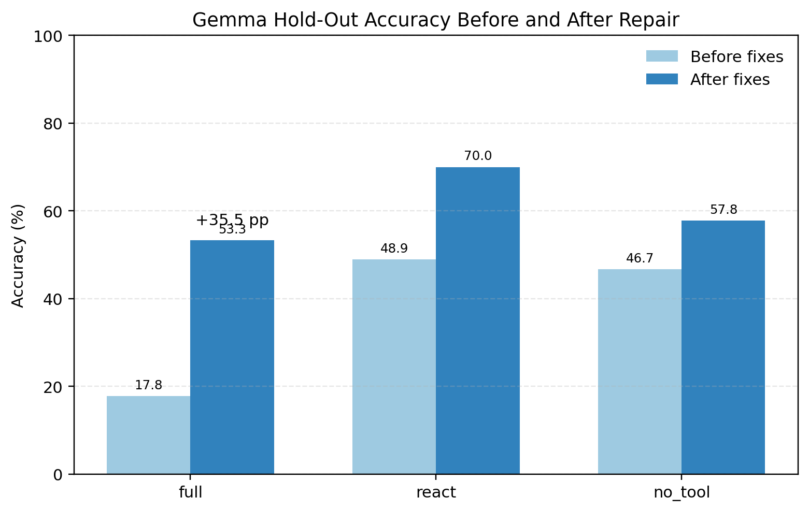
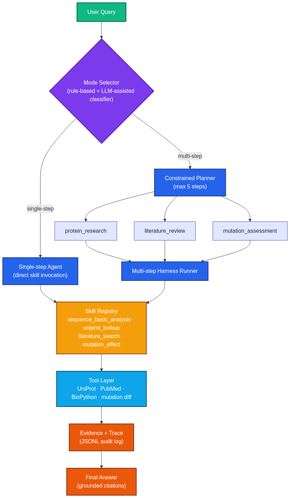

# 🧬 Open-Rosalind

> ## **Ask biology. Get answers you can trust.**
>
> *A tool-driven bio-agent for reproducible life science research.*

[](LICENSE)
[](https://doi.org/10.64898/2026.05.06.722404)
[](benchmark/BENCHMARK.md)
[](benchmark/BENCHMARK.md)
[-90%25-green)](benchmark/BENCHMARK.md)

Ask in natural language → get a structured scientific answer backed by UniProt, PubMed, and local computation. **No hallucinations** — every claim cites a tool output.

Preprint: [Open-Rosalind: Tool-First Biomedical LLM Agents with Process-Aware Benchmarking](https://doi.org/10.64898/2026.05.06.722404).
Demo: [Open-Rosalind demo](https://openrosalind.bio/).

```
You: What is BRCA1?
Open-Rosalind: P38398 is the Breast cancer type 1 susceptibility protein
                in Homo sapiens [UniProt:P38398]. It functions as an
                E3 ubiquitin-protein ligase... [+ confidence + trace]

You: find papers about this protein
Open-Rosalind: 🔗 Multi-step auto-detected.
               → uniprot.fetch → literature_search
               → 5 PubMed papers about BRCA1 [PMID:...]
```

---

## ✨ Why Open-Rosalind

| Most LLM-bio assistants | Open-Rosalind |
|---|---|
| ❌ Hallucinate accessions, PMIDs | ✅ Every claim cites a real tool output |
| ❌ "Black box" reasoning | ✅ Full execution trace per turn |
| ❌ One-shot prompts | ✅ Multi-step task harness with planner |
| ❌ Closed-source SaaS | ✅ MIT, self-hostable, model-agnostic |
| ❌ No benchmark | ✅ BioBench v0/v1/v0.3 with 5 standard metrics |

<p align="center">
  
</p>

**Design principles** (see [`docs/DESIGN_PRINCIPLES.md`](./docs/DESIGN_PRINCIPLES.md)):
- **Tool-first** — every fact comes from a registered tool, never from LLM memory
- **Evidence-grounded** — LLM may only synthesize what tools return
- **Traceable** — every tool call is logged with input/output/latency
- **Workflow-constrained** — bounded planner (max 5 steps), no free-form recursion

<p align="center">
  
</p>

---

## 🚀 Quick Start

### Option A — Docker (recommended for deployment)

```bash
# Pull the prebuilt image and run
docker run -d --name open-rosalind \
  -p 8080:80 \
  -e OPENROUTER_API_KEY=sk-or-v1-... \
  ghcr.io/maris205/open-rosalind:latest

# Open http://localhost:8080/
```

Or with `docker-compose` (clones the repo, persists data):

```bash
git clone https://github.com/maris205/open-rosalind && cd open-rosalind
export OPENROUTER_API_KEY=sk-or-v1-...
docker compose up -d --build
```

See [`docs/DOCKER.md`](./docs/DOCKER.md) for env vars, OpenAI-compat endpoint examples (vLLM / Azure / DeepSeek / Ollama), and persistent volume mounts.

### Option B — From source (development)

```bash
# 1. Install Python deps
pip install fastapi uvicorn openai requests pydantic biopython pyyaml

# 2. Set the OpenRouter key (or any OpenAI-compatible endpoint)
export OPENROUTER_API_KEY=sk-or-v1-...

# 3. Build the React UI (one-time)
cd web-react && npm install && npm run build && cd ..

# 4. Run the agent
python -m open_rosalind.cli serve

# Open http://127.0.0.1:6006/
```

**No signup needed** to try — anonymous users get one free session. To save more conversations, sign up with email + password (no email verification).

### CLI alternative

```bash
# Single question
python -m open_rosalind.cli ask "What is BRCA1?"

# Multi-step task
python -m open_rosalind.cli task run "Analyze sequence MVKVGVNGFGRIGRLVTRA and find similar proteins"

# List/inspect skills
python -m open_rosalind.cli skills list
python -m open_rosalind.cli skills inspect uniprot_lookup
```

---

## 🧩 Architecture

<p align="center">
  
</p>

### Skills are modular

Each skill is a self-contained directory with standard structure (inspired by [Claude skills](https://docs.claude.com/en/docs/build-with-claude/skills) and [DeerFlow skills](https://github.com/bytedance/deerflow)):

```
skills_v2/uniprot/
├── SKILL.md         # frontmatter + workflow + examples
├── skill.json       # schema + safety_level + tools_used
├── handler.py       # pipeline logic
├── tools.py         # API client
└── examples/        # test cases
```

Add a new skill = drop a directory. Auto-discovery picks it up. See [`docs/SKILL_SPEC.md`](./docs/SKILL_SPEC.md).

---

## 📊 Benchmarks

Open-Rosalind ships with **BioBench**, a benchmark suite specifically for bio-agents (not LLM knowledge). Tasks must trigger tool calls — pure-knowledge prompts don't count.

<p align="center">
  
</p>

| Benchmark | Tasks | Latest score (gemma-4-26b-a4b-it) |
|---|---|---|
| **BioBench v0** (basic skills) | 32 | **100.0%** |
| **BioBench v1** (workflow + edge cases + follow-up) | 49 | **93.9%** |
| **BioBench v0.3** (multi-step harness) | 10 | **90.0%** |

Five standard metrics (see [`develop/gpt4.md`](./develop/gpt4.md) and [`benchmark/BENCHMARK.md`](./benchmark/BENCHMARK.md)):
- Task accuracy
- Tool correctness
- Evidence rate
- Trace completeness
- Failure rate

<p align="center">
  
</p>

<p align="center">
  
</p>

```bash
# Reproduce
python -m open_rosalind.cli serve &
python benchmark/run_biobench.py --version mine
```

---

## 🛠️ Built-in Skills

| Skill | What it does | Tools used |
|---|---|---|
| `sequence_basic_analysis` | DNA/RNA/protein stats, GC%, translation, MW; auto-probes UniProt for protein homology | BioPython · `uniprot.search` |
| `uniprot_lookup` | Resolve accession or free-text query → structured annotation | `uniprot.fetch` · `uniprot.search` |
| `literature_search` | PubMed search with query cleaning + year-filter fallback | `pubmed.search` |
| `mutation_effect` | WT vs MT diff, HGVS parsing, physico-chemical impact heuristic | `mutation.diff` (local) |
| `clinicaltrials_search` | ClinicalTrials.gov study search with condition and status filters | `clinicaltrials.search_studies` |
| `string_network` | STRING interaction partners and network edges for protein context | `string.interaction_partners` · `string.network` |
| `chembl_search` | ChEMBL molecule or target search for drug-discovery context | `chembl.search_molecules` · `chembl.search_targets` |
| `clinvar_variation_lookup` | ClinVar/dbSNP variant identifier resolution and RefSNP summary | `clinvar_variation.search_clinical_tables` · `clinvar_variation.fetch_refsnp` |
| `gnomad_variant_lookup` | gnomAD population frequency and transcript consequence lookup | `gnomad.fetch_variant` |
| `gwas_catalog_search` | GWAS Catalog studies and association evidence by trait or gene | `gwas_catalog.search_studies` · `gwas_catalog.search_associations` |
| `opentargets_target_disease` | Open Targets target-to-disease evidence summary | `opentargets.search` · `opentargets.fetch_target_diseases` |
| `civic_variant_evidence` | CIViC cancer-variant evidence item summary | `civic.typeahead` · `civic.fetch_variant_evidence` |
| `bgee_expression_lookup` | Bgee anatomical expression summary after Ensembl gene resolution | `ensembl.lookup_gene` · `bgee.lookup_expression` |
| `human_protein_atlas_lookup` | Human Protein Atlas gene localization and expression fields | `ensembl.lookup_gene` · `human_protein_atlas.fetch_gene` |
| `rcsb_pdb_lookup` | RCSB PDB entry resolution and core structure metadata summary | `rcsb_pdb.search_entries` · `rcsb_pdb.fetch_entry` |
| `pharmgkb_clinical_annotation` | PharmGKB drug/gene/variant clinical annotation summary | `pharmgkb.search_clinical_annotations` · `pharmgkb.fetch_clinical_annotation` |
| `ncbi_blast_search` | NCBI BLAST top-hit summary with RID traceability | `ncbi_blast.run_search` |
| `efo_term_lookup` | EFO / OLS4 term resolution and ontology summary | `efo.search_terms` · `efo.fetch_term` |
| `pubchem_compound_lookup` | PubChem compound properties and description summary | `pubchem.lookup_compound` |
| `chebi_compound_lookup` | ChEBI compound definition and ontology relation summary | `chebi.search_compounds` · `chebi.fetch_compound` |
| `bindingdb_target_ligands` | BindingDB ligand evidence for a UniProt accession or PDB ID | `bindingdb.lookup_ligands` |
| `cellxgene_collection_lookup` | CELLxGENE collection metadata and dataset summaries | `cellxgene.fetch_collection` |
| `pride_project_lookup` | PRIDE project discovery and project metadata summary | `pride.search_projects` · `pride.fetch_project` |

---

## 🔄 Multi-Step Harness

For tasks that need multiple tools, the **Constrained Planner** picks one of 3 hard-coded templates:

<p align="center">
  
</p>

| Template | Steps |
|---|---|
| `protein_research` | sequence_basic_analysis → uniprot_lookup → literature_search |
| `literature_review` | literature_search |
| `mutation_assessment` | mutation_effect → uniprot_lookup → literature_search |

No free-form planning — bounded `max_steps`, no infinite loops, no autonomous tool invention. See [`docs/EXECUTION_PROTOCOL.md`](./docs/EXECUTION_PROTOCOL.md) and [`docs/MVP3_HARNESS.md`](./docs/MVP3_HARNESS.md).

---

## 🧪 In-session Context

Multi-turn conversations carry context automatically:

```
Turn 1:  介绍下 Q9H3P7
Turn 2:  这个蛋白质在别的物种中也有吗     ← agent knows it's still Q9H3P7
Turn 3:  它的功能是什么                   ← still Q9H3P7
```

Implementation: industry-standard sliding-window history (last 6 turns, 1.5K chars per turn) + entity injection from prior annotation. See `orchestrator/history.py`.

**Not** long-term memory — context window only. Cleared on new conversation.

---

## 🔌 API

```
POST /api/chat                     # main entrypoint (auto mode select)
POST /api/auth/signup              # email + password (no verification)
POST /api/auth/login
GET  /api/auth/me

GET  /api/chat/sessions            # user's sessions (sidebar)
GET  /api/chat/sessions/{id}       # full message history (replay)
GET  /api/chat/sessions/{id}/traces  # tool-call analytics

GET  /api/skills                   # list registered skills
GET  /api/skills/{name}            # full schema + examples
GET  /api/skillsv2                 # auto-discovered modular skills

GET  /api/stats                    # n_users, n_traces, top_skills, avg_latency
```

Anonymous users get a single sticky session via `anon_token` (returned on first call, sent on subsequent calls).

---

## 📦 Repository Layout

```
open_rosalind/
├── orchestrator/      router · agent · runner · history
├── harness/           Task · Planner · Runner · TaskTrace
├── skills/            (legacy) flat-file skills
├── skills_v2/         modular skills (SKILL.md + handler.py + tools.py)
├── tools/             atomic API clients (UniProt · PubMed · sequence · mutation)
├── backends/          OpenRouter (default) · pluggable
├── storage.py         SQLite (users · sessions · messages · traces)
├── server.py          FastAPI app
└── cli.py             open-rosalind serve | ask | task | skills

web-react/             Vite + React 18 chat UI
benchmark/             BioBench v0/v1/v0.3 + run_biobench.py
docs/                  design + skill spec + execution protocol
develop/               development notes (gpt*.md, mvp*.md)
traces/                JSONL trace audit log
sessions/              JSONL session events
task_traces/           JSONL multi-step task traces
```

---

## 📚 Documentation

| Document | What it covers |
|---|---|
| [`docs/DOCKER.md`](./docs/DOCKER.md) | Docker deployment, env vars, OpenAI-compat endpoints |
| [`docs/DESIGN_PRINCIPLES.md`](./docs/DESIGN_PRINCIPLES.md) | The 8 core principles (tool-first, evidence-grounded, …) |
| [`docs/SKILL_SPEC.md`](./docs/SKILL_SPEC.md) | How skills are structured + how to add one |
| [`docs/EXECUTION_PROTOCOL.md`](./docs/EXECUTION_PROTOCOL.md) | MCP-inspired execution model |
| [`docs/MVP3_HARNESS.md`](./docs/MVP3_HARNESS.md) | Multi-step planning + execution |
| [`docs/SKILLS_V2_DESIGN.md`](./docs/SKILLS_V2_DESIGN.md) | Modular skills architecture |
| [`benchmark/BENCHMARK.md`](./benchmark/BENCHMARK.md) | Bench history + metric definitions |
| [`benchmark/BIOBENCH_V1_DESIGN.md`](./benchmark/BIOBENCH_V1_DESIGN.md) | Bench task format + scoring |

---

## 🗺️ Roadmap

- ✅ **mvp1** — minimal CLI agent + 4 skills + JSONL traces
- ✅ **mvp2** — Skills Registry + React UI + Standardization + BioBench v1
- ✅ **mvp3** — Multi-step Harness (Planner + AgentAdapter + TaskRunner)
- ✅ **mvp3.1** — Modular `skills_v2/` directory layout + auto-discovery
- ✅ **mvp3.2** — Chat UI · Email auth · SQLite · in-session context · analytics · Docker
- 🔜 **mvp4** — homology search (BLAST) · OAuth · admin dashboard · paper export

---

## 🚢 Deploy in 3 minutes

On any Linux server with Docker installed:

```bash
ssh user@your-server.com
git clone https://github.com/maris205/open-rosalind && cd open-rosalind
export OPENROUTER_API_KEY=sk-or-v1-...
docker compose up -d --build
# → http://your-server.com:8080/
```

Tested on Ubuntu 22.04 / Debian 12 / Rocky 9. Works with any OpenAI-compatible LLM endpoint (OpenRouter, OpenAI, vLLM, Azure, Ollama via litellm proxy).

For mainland-China deployment, point `OPENROUTER_BASE_URL` at a domestic provider like DeepSeek or Qwen — see [`docs/DOCKER.md`](./docs/DOCKER.md).

---

## 🤝 Contributing

PRs welcome — especially new skills! See [`docs/SKILL_SPEC.md`](./docs/SKILL_SPEC.md) for the contract. A new skill is just a directory with `SKILL.md` + `skill.json` + `handler.py` + `tools.py`.

Bug reports / feature ideas: [open an issue](https://github.com/maris205/open-rosalind/issues).

---

## 📄 License

MIT — see [LICENSE](LICENSE).

---

## 📖 Citation

If you use Open-Rosalind, please cite the bioRxiv preprint:

```bibtex
@article{wang2026openrosalind,
  title  = {Open-Rosalind: Tool-First Biomedical LLM Agents with Process-Aware Benchmarking},
  author = {Wang, Liang},
  year   = {2026},
  doi    = {10.64898/2026.05.06.722404},
  url    = {https://doi.org/10.64898/2026.05.06.722404},
  journal = {bioRxiv}
}
```
