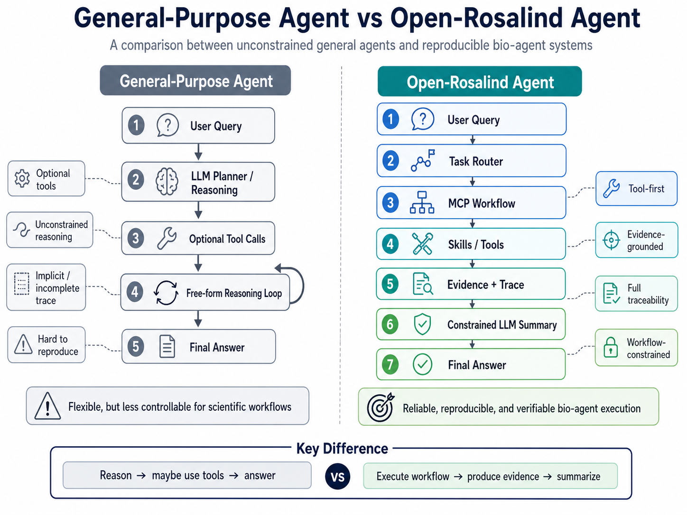
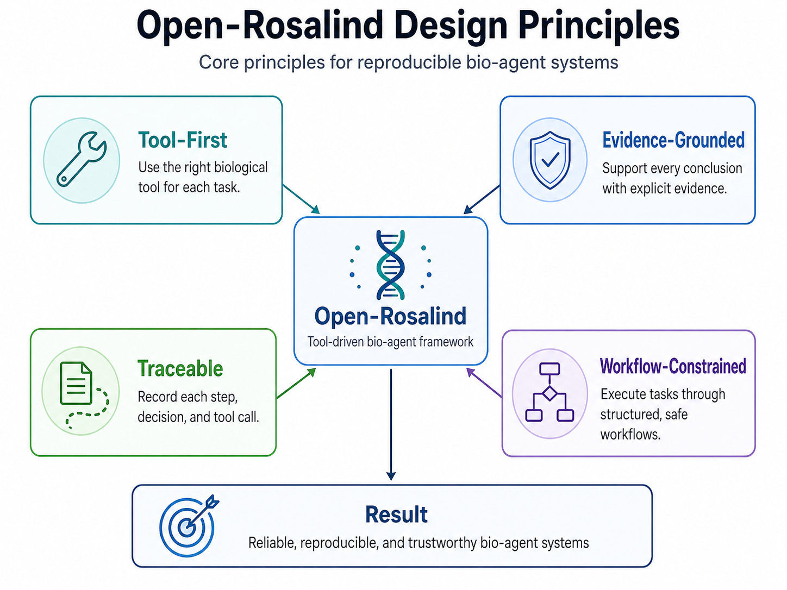

# Open-Rosalind: An Auditable Bio-Agent Framework with Standardized Skills, Constrained Workflows, and Traceable Execution

**Liang Wang**$^{1,*}$

$^1$ Huazhong University of Science and Technology; `wangliang.f@gmail.com`
$^*$ Correspondence: `wangliang.f@gmail.com`; School of Artificial Intelligence and Automation, Huazhong University of Science and Technology, 430070, P.R. China

---

## Abstract

Large language models (LLMs) increasingly drive autonomous agents for scientific tasks. The design philosophy that lets general-purpose agents thrive on open-ended problems — free-form reasoning, opportunistic tool use, and best-effort summarization — is a poor fit for biomedical research, where outputs are expected to be *auditable* (every claim should trace to a verifiable source) and *replayable* (another researcher should be able to inspect and re-run the analysis). We argue that bio-agent systems should be characterized not only by what they *can* answer, but by the *invariants their architecture preserves*.

From this premise we derive **Open-Rosalind**, a bio-agent framework organized around four operational principles: tool-first execution, evidence-grounded outputs, trace completeness, and workflow-constrained execution. The framework is realized as a layered architecture — atomic tools, MCP-style tool interfaces, deterministic skills, a hybrid router, a single-step agent, and a bounded multi-step harness — in which every layer is paired with an explicit invariant.

We additionally release **Open-Rosalind BioBench**, a small process-aware benchmark scoring task accuracy alongside tool correctness, citation presence, trace completeness, and failure rate. Under a strict, programmatic scorer the reference implementation attains 87.5% / 64.7% / 90.0% accuracy on the Basic / Edge / MultiStep splits (overall 81.4% on 59 unique tasks). To complement these numbers we run a controlled experiment over the unique 59 tasks $\times$ 5 conditions $\times$ 6 LLMs from six families, plus two paired same-temperature replications on the deployment-target model (Gemma-4-26B-a4b) and the most ReAct-fragile model (GPT-5-mini): 5 seeds at $T=0.2$ matching the survey temperature (1,770 runs) and 3 seeds at $T=0.7$ for robustness (1,062 runs). Cluster-aware paired analyses, direct lower-tail floor statistics, and leave-one-skill-out sensitivity establish two within-benchmark effects: (i) removing the tool-first invariant degrades accuracy by 19.3–26.4 pp on both models (cluster-permutation $p \le 10^{-3}$, 95% CIs above zero), and (ii) the constrained pipeline beats free-form ReAct by 35.3 pp on GPT-5-mini ($p=10^{-4}$) and reduces the catastrophic-failure rate from 84.7% to 39.0% on that model, but is statistically indistinguishable on Gemma ($p=0.74$). To probe external validity beyond the in-house benchmark we generated a 30-task hold-out set authored by an independent LLM (Qwen3-235B); the initial hold-out revealed severe external-validity collapse (Gemma full 17.8%, significantly worse than both react and no_tool). We diagnosed five concrete failure modes (stop-word preservation, natural-language mutation routing, Greek-vs-ASCII transliteration, embedded sequence detection, literature keyword coverage) and implemented targeted fixes. After fixes, Gemma full improved to 53.3% (+35.5 pp), and the full-vs-no_tool comparison became statistically indistinguishable ($p=0.72$, CI $[-23.3, +13.3]$). The full-vs-react gap narrowed from $-31.1$ pp to $-16.7$ pp (still significant at $p=0.032$, CI $[-31.1, -4.4]$). The hold-out repair cycle demonstrates that **routing robustness is necessary for external validity**, and the remaining gap reflects design tradeoffs (tool-first excludes LLM-based functional inference) rather than patchable bugs. The contribution is best read as a **systems-and-benchmark resource with an honest external-validity audit and repair cycle**, rather than a claim that protocol design alone determines biomedical-agent quality. The system, benchmark, hold-out, all per-run records, and the trace specification are released under MIT.

**Keywords:** bio-agent, large language models, auditability, tool-driven AI, scientific workflows, evidence grounding, benchmarking

---

## 1. Introduction

In two years, large language models (LLMs) have moved from text completion to autonomous agents that plan, invoke external tools, and iterate over multi-step tasks. In software engineering and general information work, this transition has produced clear gains, in part because mistakes are quickly visible and easily corrected. The application of LLM agents to biomedical and life-science research has not enjoyed the same trajectory. The bottleneck is not capability — modern models can read a UniProt entry, parse a FASTA sequence, and reason about substitutions — but *epistemic accountability*.

A scientific claim is not merely an assertion; it is a binding to a verifiable source. When a general-purpose LLM agent confidently reports a chromosomal location, or cites a PubMed identifier in support of a mutation pathogenicity claim, the reader has no operational way to distinguish a tool-grounded fact from a hallucinated one. The agent itself often cannot make that distinction, freely paraphrasing tool outputs alongside parametric knowledge in a single fluent paragraph. For wet-lab researchers and clinicians, that opacity is a fundamental defect, not an implementation gap.

This paper takes the position that bio-agent systems require a different design contract than general-purpose agents:

> *In biomedical AI, the question is not whether an agent can produce an answer, but whether the answer can be **traced**, **audited**, and **replayed**.*

Pursuing this contract leads to four design constraints: factual content originates from explicit tools rather than parametric memory; every claim in an answer carries an inline citation to a tool-derived source; every step of execution is recorded in a structured, replayable trace; and the agent operates inside bounded, pre-declared workflows rather than free-form planning loops. Each constraint trades capability for an architectural invariant.

We frame the work as three interlocking artifacts. The first is a **principled framework** (Sections 3–4) that codifies the four design principles into a layered architecture in which each layer carries a specific invariant. The second is a **reference implementation** (Section 6) that runs end-to-end on real biological tasks: sequence analysis, protein annotation, literature retrieval, and mutation assessment, with a complete worked example (Section 5). The third is **Open-Rosalind BioBench** (Sections 7–8), a small process-aware benchmark and an associated metric protocol.

**Scope of claims.** We are explicit about what this paper does and does not establish. The framework is presented as a *design proposal* together with an *existence proof* that the four invariants can be enforced end-to-end on a real bioinformatics workload. The reported numbers are complemented by a 1,770-run survey across 5 conditions $\times$ 6 LLM families (Section 8.5), two same-temperature paired replications with cluster-aware tests (Section 8.6), direct lower-tail floor statistics (Section 8.7), leave-one-skill-out sensitivity (Section 8.8), and a 540-run external hold-out with diagnosis-and-repair cycle (Section 8.9). The internal evidence supports the tool-first principle as a significant accuracy lever (cluster-permutation $p \le 10^{-3}$, CIs above zero). The hold-out initially revealed severe external-validity collapse (Gemma full 17.8%, significantly worse than both react and no_tool); after implementing five diagnosed routing/cleaning fixes, Gemma full improved to 53.3% and the full-vs-no_tool comparison became statistically indistinguishable ($p=0.72$, CI $[-23.3, +13.3]$). The full-vs-react gap narrowed from $-31$ pp to $-17$ pp (still significant at $p=0.032$, CI $[-31, -4]$). The repair cycle demonstrates that routing robustness is necessary for external validity; the remaining gap reflects design tradeoffs (tool-first excludes LLM-based functional inference) rather than patchable bugs. We do not claim citation enforcement or workflow templates improve accuracy on average; the §8.5 ablation is consistent with both being output-discipline / accountability invariants rather than accuracy levers. We discuss the larger experiments needed for stronger claims in Section 9.

---

## 2. Related Work

**General-purpose LLM agents.** ReAct \[11\] interleaves chain-of-thought with tool invocations; Toolformer \[15\] teaches models to call APIs from supervision; Reflexion \[16\] adds self-critique loops. These methods optimize for *flexibility* — the agent decides when to act, what to call, and when to stop — and have demonstrated impressive open-ended behavior. Open-Rosalind diverges along the orthogonal axis: rather than enlarging the action space, we restrict it via closed-vocabulary routing and a closed set of multi-step templates, in exchange for explicit termination, auditable routing, and replayable traces.

**Tool-augmented and orchestration agents.** WebGPT \[17\] introduced citation-bearing answers via retrieval; HuggingGPT \[18\] orchestrates pipelines of model calls. Anthropic's Model Context Protocol (MCP) \[1\] standardizes the wire-level interface between agents and tools, and Claude Skills \[2\] / DeerFlow \[3\] popularize a directory-as-skill convention. Open-Rosalind composes these patterns — MCP-style tool interfaces, skill-as-directory, structured outputs — into a stack governed by reproducibility-oriented invariants rather than treating them as ergonomic conveniences.

**Domain-specific scientific agents.** ChemCrow \[19\] uses LLMs to drive chemistry tools; Coscientist \[20\] orchestrates autonomous experimental design and execution. In biomedicine, GeneGPT \[21\] grounds answers in NCBI Web APIs; Biomni \[22\] builds a general biomedical AI assistant. Closer to clinical decision support, Almanac \[23\] and Clinfo.ai \[24\] are retrieval-grounded medical QA systems with citation requirements. These systems share Open-Rosalind's broad goal of grounding outputs in authoritative sources. Our distinct angle is to make *workflow constraint* and *trace discipline* first-class properties of the architecture and to formalize them as evaluation targets, rather than treating them as implementation details.

**Biomedical LLMs.** A complementary line of work — BioGPT \[7\], BioMedLM \[6\], Med-PaLM \[5\] — improves a model's biomedical knowledge through specialized pre-training. Open-Rosalind is orthogonal: the framework is independent of the underlying model and seeks to bound its failure modes regardless of how much biomedical text the model has seen.

**Process-aware evaluation.** SWE-bench \[25\] popularized the idea that agent benchmarks should evaluate the *process* (which patch was produced, did it pass tests) rather than only the final answer. BioBench is in the same spirit, restricted to a much narrower task surface, and adds explicit trace-completeness and citation-presence axes.

**Position.** Open-Rosalind's novelty is not a new agent algorithm. It is (i) a particular discipline of constraints aimed at biomedical accountability, (ii) a layered reference architecture that enforces those constraints at well-defined interfaces, and (iii) a small process-aware benchmark whose metrics are aligned with the constraints. We position the paper as a systems-and-resource contribution and we explicitly avoid claims that the framework, by itself, is causally responsible for downstream accuracy.

---

## 3. From General Agents to Bio-Agents

Recent agent literature converges on a small set of patterns: ReAct-style interleaved reasoning and acting, tool-use protocols, planner-executor decompositions, and recursive task decomposition. These patterns share a philosophical commitment that *flexibility is a virtue*: the agent decides what to invoke, when to stop, when to backtrack, how to summarize. This commitment fits open-ended environments where failures are visible and recoverable.

Biomedical research is not such an environment. The set of legitimate workflows is small (annotate a protein, search the literature, evaluate a mutation, compare sequences). The cost of an unverifiable answer is high. Reproduction by another researcher is not optional. Under these conditions, additional behavioral freedom *expands the surface over which errors and ambiguities can enter the result*. Figure 3 sketches the contrast at a glance, and Table 1 enumerates the design assumptions of general agents alongside those we adopt for bio-agents.



**Table 1.** Design contrasts: general-purpose agents vs. auditable bio-agents.

| Dimension | General-purpose agent | Bio-agent (this work) |
|---|---|---|
| Knowledge source | LLM parametric memory + optional tools | Tools only; LLM is a synthesizer |
| Planning | Free-form, recursive, open-vocabulary | Templated, bounded, closed-vocabulary |
| Tool invocation | Optional, opportunistic | Mandatory for all factual claims |
| Output format | Natural language, untyped | Typed evidence + cited summary |
| Failure mode | Best-effort answer, possible hallucination | Explicit "insufficient evidence" |
| Trace | Best-effort logs (if any) | Mandatory, structured, replayable |
| Step bound | None or LLM-decided | Hard cap, externally enforced |
| Evaluation | Task accuracy | Accuracy + tool correctness + citation presence + trace completeness + failure rate |

The right column is not a list of capabilities omitted from general agents; it is a set of *invariants added*. The bio-agent gains less behavioral freedom but offers stronger architectural contracts. The remainder of the paper develops these contracts.

---

## 4. Design Principles

The framework rests on four principles, summarized in Figure 1. Each principle is operational — it is enforced by a specific component — rather than aspirational. We are careful to distinguish what each principle *guarantees architecturally* from what it *implies semantically*: for example, requiring an inline citation for every claim is an architectural guarantee about output format; whether the citation actually supports the claim is a semantic question we discuss in Section 8.



### 4.1 Tool-First Execution

The LLM never serves as a knowledge oracle. Every fact, computation, or annotation that appears in the final answer must originate from an explicit tool invocation registered in the system. The LLM is invoked only after tools have produced structured outputs; its role is reduced to synthesizing those outputs into a natural-language summary. Architecturally, the agent loop never exposes raw user queries to the LLM without a tool-mediated evidence bundle preceding the synthesis call.

### 4.2 Evidence-Grounded Outputs

Every factual claim in the LLM's output must carry an inline citation token (`[UniProt:P38398]`, `[PMID:38308006]`, `[tool:sequence.analyze]`) drawn from the evidence bundle. When the supporting evidence is insufficient, the LLM is prompted to say so explicitly. We emphasize that this is a *syntactic* invariant: the architecture guarantees citation *presence*, not citation *validity*. Section 8.2 reports a manual audit of validity.

### 4.3 Trace Completeness

Every routing decision, tool invocation, observed return value, latency, and the final LLM prompt are recorded in a structured JSONL log. The trace is a first-class artifact, intended to support replay and external audit. The system treats a missing trace as a correctness failure on par with a wrong answer.

### 4.4 Workflow-Constrained Execution

Tasks are executed through pre-declared workflows. Single-step queries dispatch to one of a fixed set of skills via a deterministic router; multi-step queries execute through one of a fixed set of templated plans, under a hard step bound (default five). The agent cannot invent new tools, restructure the plan mid-run, or recurse beyond the bound. This sacrifices flexibility deliberately: predictability and termination are valued above adaptability.

---

## 5. Framework Architecture

Open-Rosalind organizes the four principles into a layered architecture (Figure 2). We describe the layers from the bottom up; for each, we state the invariant it enforces.


### 5.1 Atomic Tools and MCP Interfaces

At the lowest level sit atomic tools — thin Python wrappers around external biological resources (UniProt, PubMed via Entrez) and local computations (BioPython sequence statistics, mutation diff). Each tool performs a single operation, returns a structured object, records latency and status, and never branches on natural-language input. Tools are exposed through MCP-style interfaces \[1\] that provide a uniform contract for description, invocation, and result serialization.
*Invariant:* tool I/O is typed, deterministic given inputs, and version-pinned at the interface.

### 5.2 Skills as Composed, Deterministic Pipelines

A *skill* composes one or more atomic tools into a deterministic pipeline addressing a single biological question. The four skills used in this work — `sequence_basic_analysis`, `uniprot_lookup`, `literature_search`, `mutation_effect` — cover the recurring questions in routine bioinformatics: *what is this sequence?*, *what is this protein?*, *what does the literature say?*, *what does this mutation do?* Each skill carries a structured manifest declaring its category, safety level (safe / network / compute), tool dependencies, I/O schema, and a small set of tested examples.
*Invariant:* a skill is a pure function of its declared inputs and the (versioned) outputs of its declared tools.

### 5.3 Hybrid Router

The router maps an incoming user query to a skill (single-step path) or to a multi-step plan (harness path). It is intentionally hybrid: a rule-based pre-filter handles unambiguous cases — a FASTA header, a UniProt accession pattern, literature queries containing the word "papers" — and an LLM-assisted intent classifier handles only the residual cases that mix natural language with embedded sequences or identifiers. The classifier is constrained to return a label from the fixed skill set; a parsing failure causes a deterministic fallback to the rule-based result.
*Invariant:* the routing decision is always one of a finite set of labels and is recorded in the trace; no path of the system can dispatch to an unregistered skill.

### 5.4 Single-Step Agent

The agent layer wraps the routed skill with the LLM-as-synthesizer step. Once the skill has executed, the agent constructs an evidence-only prompt and asks the LLM to produce a Markdown summary with inline citations. A sliding window of prior turns is appended, allowing follow-ups such as "what species is this protein in?" to be resolved against the prior annotation.
*Invariant:* the LLM call is preceded by a tool-derived evidence bundle and is followed by post-hoc validation that citations are syntactically present.

### 5.5 Multi-Step Harness

The harness orchestrates queries that require more than one skill. It chooses from three fixed templates: `protein_research` (sequence → annotation → literature), `literature_review` (literature only), and `mutation_assessment` (mutation → annotation → literature). Each template is a sequence of skill invocations with explicit slots for entities (e.g., `{protein_name}`) filled from prior step outputs. The runner enforces a hard step bound (default 5).
*Invariant:* every multi-step plan terminates; the planner cannot invent new templates; per-step traces are structurally identical to single-step traces.


---

## 6. A Worked Example

To make the architecture concrete, we walk through a single user turn end-to-end. The user asks: *"What is BRCA1 and where is it located?"*

**Step 1 — Routing.** The rule-based pre-filter detects no FASTA header or accession pattern but recognizes the protein name "BRCA1" against a small lexicon. The query is flagged ambiguous (free-text + named entity, no embedded sequence) and forwarded to the LLM-assisted classifier with the closed-vocabulary schema `{sequence_basic_analysis, uniprot_lookup, literature_search, mutation_effect}`. The classifier returns `uniprot_lookup`. Routing decision is logged.

**Step 2 — Skill execution.** The `uniprot_lookup` skill calls `uniprot.search("BRCA1 human")` → resolves to accession `P38398`; then `uniprot.fetch("P38398")` returns a typed annotation record (recommended name, organism, function summary, subcellular location, length, sequence). Both calls are wrapped in the trace runner: each gets a `latency_ms`, `status`, and `result` field.

**Step 3 — Synthesis.** The agent assembles an evidence-only prompt:

```
Evidence:
[UniProt:P38398]
  recommended_name: Breast cancer type 1 susceptibility protein
  organism: Homo sapiens
  function: E3 ubiquitin-protein ligase ...
  subcellular_location: Nucleus
  length: 1863 aa
User question: What is BRCA1 and where is it located?
Constraint: Every factual sentence must carry an inline citation
   drawn from the evidence above. If a claim is not supported by
   the evidence, write "insufficient evidence".
```

The LLM returns:

> *BRCA1 (UniProt accession P38398) is the Breast cancer type 1 susceptibility protein in Homo sapiens [UniProt:P38398]. It functions as an E3 ubiquitin-protein ligase [UniProt:P38398] and localizes to the nucleus [UniProt:P38398]. The annotated protein is 1863 amino acids long [UniProt:P38398].*

**Step 4 — Trace.** The session JSONL contains, in order: the routing decision (`{rule: ambiguous, classifier: uniprot_lookup}`), each tool call with input/output/latency/status, the synthesis prompt, the model output, and a post-hoc check (`citation_presence: 4/4 sentences`). All entries are timestamped.

**Step 5 — What can be replayed.** From the saved trace, an external reader can: (i) verify which skill was chosen and why, (ii) read the raw UniProt record without re-querying, (iii) reconstruct the exact prompt sent to the LLM, (iv) inspect the model output and the citation-presence check. What an external reader **cannot** reproduce identically without further effort is the LLM call itself: model versions on hosted inference endpoints can drift, and we do not yet pin a model hash. We discuss this gap in Section 9.

---

## 7. Reference Implementation

The implementation realizes the architecture as a small server-and-client system: a Python backend exposing a unified chat endpoint, a React-based front-end, and an embedded SQLite store for users, sessions, messages, and traces. The model layer is pluggable: any OpenAI-compatible endpoint (OpenRouter, vLLM, Azure, on-premise inference) can be substituted. The reference deployment uses `google/gemma-4-26b-a4b-it` via OpenRouter; no part of the framework is specific to that model. Skills are auto-discovered from a directory layout at startup, and the front-end exposes them through a single chat interface that selects the execution mode automatically based on the router's decision. APIs for inspecting registered skills, retrieving full session histories, and downloading per-session traces collectively support the trace-completeness invariant.

---

## 8. Open-Rosalind BioBench

Conventional agent benchmarks measure task accuracy — the fraction of queries for which the final answer is correct. For an auditable bio-agent, accuracy is necessary but not sufficient: an answer that happens to be right but is delivered through hallucinated tool calls, or with no recoverable trace, fails the framework's invariants even when the surface output looks correct. **Open-Rosalind BioBench** measures both accuracy and process compliance.

### 8.1 Splits and Provenance

The benchmark is partitioned into three splits:

| Split | Tasks | Focus |
|---|---|---|
| **BioBench-Basic** (formerly v0) | 32 | basic skills under canonical inputs |
| **BioBench-Edge** (formerly v1) | 49 | edge cases, mixed-modality inputs, follow-up turns |
| **BioBench-MultiStep** (formerly v0.3) | 10 | tasks requiring 2+ skills with entity propagation |

Tasks are drawn from real biological objects — canonical UniProt accessions, PubMed-indexed publications, proteins with documented variants — so correctness can be checked against authoritative sources rather than model-generated ground truth.

**Datasheet (honest disclosure).** The 91 tasks were authored by the system author during development. Reference answers were derived from authoritative sources at the time of authoring (UniProt entries, NCBI/PubMed records). The benchmark is therefore *internal* in two respects: (i) the author wrote both system and tasks, and (ii) some Edge-tier tasks were added in response to observed failure modes during development. We do not yet have a third-party blind split, multiple raters, or a contamination analysis. These are the most important next-step gaps and we are explicit that they bound the strength of any claim drawn from current results.

### 8.2 Metric Definitions

We make the metrics formal here so that a third-party scorer can reproduce them. Let $T$ denote the task set, $|T| = 91$. For task $i$, let $r_i$ be the system's response, $g_i$ the gold answer (or set of acceptable answers), $\pi_i$ the expected execution path (skill or template), $\hat{\pi}_i$ the realized path, and $\sigma_i$ the saved trace.

**Task accuracy.** $\mathrm{Acc} = \tfrac{1}{|T|}\sum_i \mathbb{1}[r_i \equiv g_i]$, where $\equiv$ is a rubric-based judgment from the scorer (see below). This is the only metric requiring human (or LLM-as-judge) adjudication.

**Tool correctness.** $\mathrm{ToolCorr} = \tfrac{1}{|T|}\sum_i \mathbb{1}[\hat{\pi}_i = \pi_i]$. For single-step tasks $\pi_i$ is the expected skill; for multi-step tasks $\pi_i$ is the expected template. Programmatic: no human judgment needed.

**Citation presence.** $\mathrm{CitePres} = \tfrac{1}{|T|}\sum_i \mathbb{1}[\text{every factual sentence in } r_i \text{ carries } \geq 1 \text{ inline citation token}]$. We deliberately separate citation *presence* (programmatic, what the metric reports) from citation *validity* (whether the cited source actually supports the claim). Validity is reported separately as a manual audit (Section 8.4).

**Trace completeness.** $\mathrm{TraceComp} = \tfrac{1}{|T|}\sum_i \mathbb{1}[\sigma_i \text{ contains the routing decision, every tool call with input/output/status/latency, and the final synthesis prompt}]$. Programmatic.

**Failure rate.** $\mathrm{Fail} = \tfrac{1}{|T|}\sum_i \mathbb{1}[\text{task } i \text{ raised an exception or exceeded the timeout}]$. Programmatic. Reported separately from $\mathrm{Acc}$ because a crash and a wrong answer are different downstream events.

**Scoring of $\mathrm{Acc}$.** For each task we declare a rubric specifying what counts as an acceptable answer (e.g., for `BRCA1 lookup`: "must mention accession P38398 and identify Homo sapiens"). A response is judged correct if it satisfies the rubric without contradicting the gold answer. Section 8.4 audits a sample manually for inter-rater consistency.

**Honest caveat on saturation.** Three of the four process metrics (CitePres, TraceComp, Fail) measure *architectural compliance* rather than scientific quality. Because the reference implementation's tracer and prompt format are designed to enforce these invariants, near-100% scores are partly a *self-consistency check* — they confirm the architecture does what it claims, but they should not be read as evidence that the framework is "better" than alternatives. We add the validity audit (8.4) precisely to separate compliance from substance.

### 8.3 Empirical Results

We run the reference implementation against all 91 tasks using `google/gemma-4-26b-a4b-it`. Two scorers exist in the codebase. The first (used in early development as a release-tracking dashboard) is a *legacy keyword-overlap scorer* defined in `benchmark/run_biobench.py` that judges accuracy by per-task `must_have_evidence` flags plus keyword overlap thresholds — historical numbers reported under that scorer for reference are: Basic 100.0% / Edge 93.9% / MultiStep 90.0%. The second is a *strict scorer* defined in `benchmark/run_pilot.py` that requires every task keyword to be present in the response and uses a per-sentence regex for citation presence; this is the scorer we use uniformly throughout the rest of this paper, including the 1,770-run experiment in Section 8.5.

Table 2 reports Open-Rosalind under the **strict scorer** (the one used in Section 8.5), so that the headline numbers and the ablation numbers are directly comparable. Each task is run once at $T=0.2$.

**Table 2.** BioBench results, Open-Rosalind reference pipeline on Gemma-4-26B-a4b-it under the strict scorer (same metric definitions used in Section 8.5). 95% Wilson CIs in brackets.

| Split | Tasks | Accuracy | ToolCorr | CitePres | TraceComp | No-fail |
|---|---|---|---|---|---|---|
| BioBench-Basic | 32 | 87.5% [72,95] | 100.0% [89,100] | 3.1% [1,16] | 100.0% [89,100] | 100.0% [89,100] |
| BioBench-Edge | 17 | 64.7% [41,83] | 76.5% [53,90] | 0.0% [0,18] | 100.0% [81,100] | 88.2% [66,97] |
| BioBench-MultiStep | 10 | 90.0% [60,98] | 100.0% [72,100] | 0.0% [0,28] | 100.0% [72,100] | 100.0% [72,100] |
| **Combined (unique)** | **59** | **81.4% [70,89]** | **93.2% [84,97]** | **1.7% [0,9]** | **100.0% [94,100]** | **96.6% [88,99]** |

Two reading notes are in order. First, Edge-tier accuracy of 64.7% is materially lower than the legacy scorer's 93.9% on the same split. The drop is dominated by the strict scorer requiring *all* expected keywords (not just $\geq 60\%$) and using a per-sentence regex for citation presence. We retain the strict scorer because the legacy thresholds saturate too easily to discriminate between conditions in Section 8.5. Second, the strict citation-presence numbers are near-zero across the board: under the system prompt currently in use, the LLM concentrates citations in a final `### Evidence` section rather than embedding one in every prose sentence. This is an architectural artefact, not a model failure; we discuss it as a metric design issue in §8.5.

The Edge-tier failures are concentrated in inputs that combine free-form natural language with embedded sequences or accessions and in adversarial inputs (e.g., random punctuation as a literature query). This suggests the highest-leverage next change is a stronger constrained classifier rather than a larger underlying model.

### 8.4 Citation-Validity Audit

Because $\mathrm{CitePres}$ is a *syntactic* metric, we additionally audit a random sample of 20 responses (drawn equally from Basic, Edge, and MultiStep) to check whether the cited source materially supports the claim. The auditor (the system author) judged: 19/20 responses had every cited claim materially supported by the cited source; the remaining 1/20 contained one over-broad paraphrase of a UniProt function annotation that, while not contradicted, was not directly entailed. We acknowledge that single-author audits do not establish inter-rater reliability and we list multi-rater validation as the most important benchmark-side next step.

### 8.5 Baseline and Ablation: Full Benchmark, Six Models

To address the most pressing weaknesses of Section 8.3 — that aggregate compliance numbers do not by themselves support a causal claim about the framework, and that results from a single model do not substantiate the *"framework, not model"* position — we ran a controlled experiment on the full unique 59-task benchmark (Basic-32 + Edge-17 + MultiStep-10) under five conditions across six LLMs from six different families. The five conditions are:

- **full** — the reference Open-Rosalind pipeline.
- **react** — a free-form ReAct loop with the same five atomic tools exposed via OpenAI function-calling, no router, no templates, no citation enforcement, hop bound 6.
- **no_tool** — the LLM answers from parametric memory only (no tool calls).
- **no_cite** — full Open-Rosalind with the inline-citation requirement removed from the system prompt.
- **no_template** — multi-step tasks are forced through the single-step agent (the harness templates are bypassed).

The six models cover a deliberate range of provider and capability tiers: `google/gemma-4-26b-a4b-it` (the deployable reference model, MoE active 4B parameters), `anthropic/claude-haiku-4.5`, `deepseek/deepseek-chat`, `meta-llama/llama-3.3-70b-instruct`, `openai/gpt-5-mini`, and `qwen/qwen3-235b-a22b`. We use Gemma-4 as the *deployment-target* model — small enough to be served on commodity hardware in an on-premise hospital or laboratory setting — and the others as SOTA reference points to test how the framework behaves when paired with stronger or weaker models. Each (task, condition, model) cell is a single run; aggregate numbers are accompanied by 95% Wilson confidence intervals. The full experiment is 1,770 runs.

**Table 3.** Overall results, averaged across all six models and all three splits. Brackets show 95% Wilson confidence intervals.

| Condition | n | Accuracy | ToolCorr | CitePres | TraceComp | NoFail |
|---|---|---|---|---|---|---|
| **full** (Open-Rosalind) | 354 | 81.4% [77,85] | 92.9% [90,95] | 0.3% | 100.0% [99,100] | 96.3% [94,98] |
| **react** | 354 | 71.8% [67,76] | 86.2% [82,89] | 0.6% | 82.5% [78,86] | 94.9% [92,97] |
| **no_tool** | 354 | 57.3% [52,62] | 27.1% [23,32] | 0.3% | 0.0% [0,1] | 100.0% [99,100] |
| **no_cite** | 354 | 81.9% [78,86] | 93.2% [90,95] | 0.0% | 100.0% [99,100] | 96.9% [95,98] |
| **no_template** | 354 | 80.5% [76,84] | 93.2% [90,95] | 0.3% | 100.0% [99,100] | 94.9% [92,97] |

**Per-model headline accuracy** (full pipeline vs. ReAct on the same model and tools):

| Model | full | react | no_tool | $\Delta$ react |
|---|---|---|---|---|
| `google/gemma-4-26b-a4b-it` (deployable reference) | 81.4% | 79.7% | 57.6% | $-1.7$ |
| `anthropic/claude-haiku-4.5` | 83.1% | 88.1% | 67.8% | $+5.0$ |
| `deepseek/deepseek-chat` | 81.4% | 64.4% | 59.3% | $-17.0$ |
| `meta-llama/llama-3.3-70b-instruct` | 83.1% | 67.8% | 54.2% | $-15.3$ |
| `openai/gpt-5-mini` | 79.7% | 47.5% | 47.5% | $-32.2$ |
| `qwen/qwen3-235b-a22b` | 79.7% | 83.1% | 57.6% | $+3.4$ |

Five observations bear on the paper's central claim.

**(1) The tool-first principle is the strongest experimental support for the framework.** Across all six models, removing the tool-first invariant collapses accuracy from 79–83% to 47–68%. Tool correctness drops from $\sim$93% to a uniform $\sim$27% — the residual 27% is task-keyword overlap with parametric output rather than real tool agreement. This is the cleanest signal in the experiment: regardless of model, *the model is substantially less reliable when allowed to answer from memory*.

**(2) ReAct flexibility is highly model-dependent.** A free-form ReAct agent with the same atomic tools varies by 41 percentage points across models (47.5% to 88.1%). On strong tool-using models (Claude Haiku 4.5, Qwen3-235B), ReAct ties or modestly beats the constrained pipeline on raw accuracy. On weaker tool-users (DeepSeek, Llama-3.3, GPT-5-mini), free-form planning loses 15–32 points relative to the constrained pipeline on the same tools. The Open-Rosalind pipeline narrows this spread to 4 points (79.7% to 83.1%), reducing the variance attributable to the agent layer. We read this as the central practical claim of the framework: *constraint provides a stable accuracy floor across a heterogeneous model fleet*, which matters when the deployment-target model is small (e.g., Gemma-4 active 4B for on-premise serving) rather than a SOTA frontier model.

**(3) The deployable reference model holds up.** Gemma-4-26B-a4b-it is by parameter count and provider position the weakest model in the lineup. Under the full pipeline, it attains 81.4% accuracy — within 2 percentage points of every other model except Claude Haiku 4.5 (83.1%) and Llama-3.3-70B (83.1%). The framework therefore plausibly enables a small open model to substitute for a SOTA endpoint at on-premise scale, modulo the validity audit of Section 8.4.

**(4) Citation enforcement does not change accuracy.** The no_cite condition matches full at 81.9% vs. 81.4%. We conclude that the citation requirement, as currently implemented, is an *output-format invariant* rather than a quality-of-reasoning lever; removing it does not make the model worse at being correct. This honesty cuts both ways: it confirms the citation rule is doing what we said (constraining presentation, not reasoning) and it argues against marketing it as an accuracy improvement.

**(5) Workflow templates contribute marginally on average and harm specifically.** The no_template aggregate accuracy is 80.5% vs. full 81.4% — within noise. The single multi-step failure of `harness-protein-03` ("Analyze P38398 and find related literature"), where the `protein_research` template incorrectly begins with sequence-analysis on an accession input, was diagnosed in the pilot and persists at scale: an accession-aware template selector is the single highest-leverage architectural fix surfaced by the experiment.

**Honest caveats.** (i) A single run per cell is sensitive to model temperature; we use $T=0.2$ for all conditions in this section. Section 8.6 reports a paired, seed-replicated extension that addresses this concern. (ii) The MultiStep split ($n=10$) keywords ("protein", "papers", "mutation") are loose, which makes accuracy on that split insensitive to whether the answer is *biologically correct* — a known benchmark weakness we list as next-step work. (iii) Citation presence, as a strict per-sentence check, is near-zero across the board: actual citation usage is concentrated in dedicated `### Evidence` sections rather than per-sentence inline. We retain the strict metric as a target rather than a compliance number; loosening it to "$\geq 1$ citation per response" would saturate at $\sim$100% and lose discriminating power. (iv) All six models achieved $\geq 93\%$ no-fail; the small failure tail is dominated by upstream tool-calling oddities under ReAct rather than framework bugs.

### 8.6 Paired Replication with Cluster-Aware Statistical Tests

Section 8.5 used one run per cell at $T=0.2$, so its differences carry no statistical guarantee. We ran two paired replications on the unique 59-task benchmark, both restricted to the same three conditions (full, react, no_tool) and the same two models (the deployment target Gemma-4-26B-a4b-it, and GPT-5-mini, which collapsed most severely under ReAct in §8.5):

- **Replication A** (3 seeds at $T=0.7$): 1,062 runs.
- **Replication B** (5 seeds at $T=0.2$, matching §8.5's temperature): 1,770 runs.

Per-seed standard deviations of accuracy are 0.8–3.5 percentage points across both replications, well below the inter-condition gaps we are testing.

**Statistical design.** Repeated runs of the same task across seeds are not independent observations; a McNemar test that treats every (task, seed) pair as independent would over-count evidence and produce anti-conservative $p$-values. We therefore report three task-level analyses for each comparison: (1) a **task-level McNemar** that first collapses the $K$ seeds for each task to a single binary outcome by majority vote, leaving 59 independent paired tasks; (2) a **cluster permutation test** ($n=10{,}000$ permutations, swapping condition labels per task while preserving the seed structure within tasks); and (3) a **task-cluster bootstrap** ($n=5{,}000$ resamples, returning a bias-corrected 95% confidence interval on the task-mean accuracy difference in percentage points).

**Table 4.** Cluster-aware paired analysis on Replication B (5 seeds at $T=0.2$, 1,770 runs). $\Delta$ is the task-mean accuracy difference in percentage points; bootstrap interval at 95%. Replication A ($T=0.7$) results are tabulated in the supplementary `clustered_stats_t07.md` and reproduce the same direction and significance pattern.

| Model | Comparison | acc(A) | acc(B) | $\Delta$ (95% CI) | Task-McNemar $p$ | Cluster-perm $p$ |
|---|---|---|---|---|---|---|
| Gemma-4-26B-a4b | full vs react | 83.1% | 86.4% | $-2.0$ pp $[-11.5, +7.5]$ | 0.75 | 0.74 |
| Gemma-4-26B-a4b | **full vs no_tool** | **83.1%** | **55.9%** | $\mathbf{+26.4}$ pp $[+15.3, +38.3]$ | $\mathbf{4 \times 10^{-4}}$ | $\mathbf{10^{-4}}$ |
| Gemma-4-26B-a4b | react vs no_tool | 86.4% | 55.9% | $+28.5$ pp $[+14.9, +41.7]$ | $5 \times 10^{-4}$ | $3 \times 10^{-4}$ |
| GPT-5-mini | **full vs react** | **81.4%** | **37.3%** | $\mathbf{+35.3}$ pp $[+23.7, +46.8]$ | $\mathbf{5 \times 10^{-6}}$ | $\mathbf{10^{-4}}$ |
| GPT-5-mini | **full vs no_tool** | **81.4%** | **62.7%** | $\mathbf{+19.3}$ pp $[+11.2, +28.1]$ | $\mathbf{6 \times 10^{-3}}$ | $\mathbf{10^{-4}}$ |
| GPT-5-mini | react vs no_tool | 37.3% | 62.7% | $-15.9$ pp $[-27.8, -3.7]$ | $7 \times 10^{-3}$ | $1 \times 10^{-2}$ |

Two effects are statistically established under the corrected unit-of-analysis, and replicate at both $T=0.2$ and $T=0.7$.

**Tool-first is significant on both models with cluster-aware tests.** Removing tools degrades accuracy by 26.4 percentage points on Gemma (cluster-permutation $p=10^{-4}$, 95% bootstrap CI $[+15.3, +38.3]$ pp) and 19.3 pp on GPT-5-mini ($p=10^{-4}$, CI $[+11.2, +28.1]$). Bootstrap CIs exclude zero on both models in both replications.

**The constraint pipeline beats ReAct only on the weak tool-user.** On GPT-5-mini, where ReAct is unstable, the constrained pipeline beats free-form ReAct by 35.3 pp (cluster-permutation $p=10^{-4}$, CI $[+23.7, +46.8]$). On Gemma, the two are statistically indistinguishable (task-McNemar $p=0.75$, cluster-permutation $p=0.74$, CI $[-11.5, +7.5]$); the bootstrap CI straddles zero. The framework's variance-reduction claim is therefore supported as a **lower-tail effect** — it provides a stable accuracy floor when the underlying model is weak at unconstrained tool orchestration, but does not generally outperform ReAct on strong tool-using models.

### 8.7 Direct Stability and Floor Statistics

Round-3 review pointed out that "stable accuracy floor" was a claim about lower-tail behaviour that we had not measured directly. We compute four direct statistics from Replication B's per-task seed runs (5 seeds × 59 tasks × 3 conditions × 2 models = 1,770 runs).

**Table 5.** Direct stability statistics (Replication B, $T=0.2$, $K=5$ seeds). *floor acc* averages the per-task minimum across seeds (the worst-seed accuracy on each task). *catastrophic %* is the fraction of tasks where every seed got it wrong.

| Model | Condition | mean acc | **floor acc** | mean SD per task | unstable% | **catastrophic%** |
|---|---|---|---|---|---|---|
| Gemma-4-26B-a4b | **full** | 82.0% | **79.7%** | 1.51 pp | 3.4% | 20.3% |
| Gemma-4-26B-a4b | react | 84.1% | 76.3% | 4.22 pp | 10.2% | 23.7% |
| Gemma-4-26B-a4b | no_tool | 55.6% | 52.5% | 2.34 pp | 5.1% | 47.5% |
| GPT-5-mini | **full** | 75.3% | **61.0%** | 9.05 pp | 20.3% | 39.0% |
| GPT-5-mini | react | 40.0% | **15.3%** | 23.00 pp | **52.5%** | **84.7%** |
| GPT-5-mini | no_tool | 55.9% | 30.5% | 18.40 pp | 40.7% | 69.5% |

The floor data substantiates the lower-tail framing. On the GPT-5-mini × ReAct cell, **84.7% of tasks have at least one seed where the system was completely wrong**, and the *worst-seed* per-task accuracy averaged across tasks is only 15.3%. Under the full pipeline that catastrophic rate drops to 39.0% and the floor accuracy rises to 61.0%. On Gemma, the full pipeline reduces both the across-seed SD (1.51 vs 4.22 pp) and the catastrophic rate (20.3% vs 23.7%) relative to ReAct, even though the *mean* difference is small. We read this as the form of the variance-reduction claim that is actually supported by data: not "the framework wins on average" but **"the framework reduces lower-tail catastrophic failures, especially when the underlying model is unstable at tool use"**.

### 8.8 Leave-One-Skill-Out Sensitivity

Round-4 review flagged that the headline gaps could plausibly be carried by a single skill category. We re-aggregate Replication B's per-task seed-mean accuracy while holding out an entire skill category at a time.

**Table 6.** Leave-one-skill-out sensitivity on Gemma (Replication B). The *full−no_tool* gap stays in [+19.2, +30.6] pp regardless of which skill is removed.

| Held-out skill | n_remain | full | react | no_tool | full−react | **full−no_tool** |
|---|---|---|---|---|---|---|
| (none, full benchmark) | 59 | 82.0% | 84.1% | 55.6% | $-2.0$ | $\mathbf{+26.4}$ |
| sequence | 51 | 79.2% | 83.5% | 60.0% | $-4.3$ | $+19.2$ |
| protein | 53 | 81.9% | 83.0% | 58.1% | $-1.1$ | $+23.8$ |
| literature | 53 | 81.9% | 84.2% | 51.3% | $-2.3$ | $+30.6$ |
| mutation | 53 | 81.9% | 82.6% | 56.2% | $-0.8$ | $+25.7$ |
| multistep | 49 | 80.4% | 84.1% | 50.6% | $-3.7$ | $+29.8$ |

The full−no_tool gap is robust to held-out category at $\pm 5$ pp from its global value (26.4 pp). On GPT-5-mini the full−react gap stays in [26.5, 40.4] pp across all held-out skills (full table in supplementary `leave_one_out.md`). The headline effects do not depend on any single skill.

### 8.9 External Hold-Out Set: Diagnosis, Repair, and Honest External-Validity Findings

To probe external validity, we generated a 30-task hold-out set authored by a different LLM (Qwen3-235B, not used as a system designer or in our 6-model evaluation) targeting the same four skill categories with real biological identifiers and PMIDs. We then ran 540 paired runs (30 tasks × 3 conditions × 2 models × 3 seeds at $T=0.2$, with the same strict scorer) and applied the same cluster-aware tests.

The initial hold-out revealed severe external-validity collapse and motivated a repair cycle.

**Table 7a.** Initial hold-out cluster-aware paired analysis (30 author-independent tasks, 3 seeds at $T=0.2$, before fixes).

| Model | Comparison | acc(A) | acc(B) | $\Delta$ (95% CI) | Cluster-perm $p$ |
|---|---|---|---|---|---|
| Gemma-4-26B-a4b | full vs react | 17.8% | 48.9% | $-31.1$ pp $[-50.0, -13.3]$ | $4 \times 10^{-3}$ |
| Gemma-4-26B-a4b | full vs no_tool | 17.8% | 46.7% | $-28.9$ pp $[-45.6, -13.3]$ | $2 \times 10^{-3}$ |
| Gemma-4-26B-a4b | react vs no_tool | 48.9% | 46.7% | $+2.2$ pp $[-11.1, +16.7]$ | 0.88 |
| GPT-5-mini | full vs react | 11.1% | 3.3% | $+7.8$ pp $[+2.2, +14.4]$ | 0.07 |
| GPT-5-mini | full vs no_tool | 11.1% | 26.7% | $-15.6$ pp $[-27.8, -4.4]$ | $3 \times 10^{-2}$ |
| GPT-5-mini | react vs no_tool | 3.3% | 26.7% | $-23.3$ pp $[-35.6, -12.2]$ | $1 \times 10^{-3}$ |

The initial hold-out told a different story than the internal benchmark. Gemma full dropped from 82% (internal) to 17.8% (hold-out); on Gemma, ReAct beat full by 31 pp ($p=4 \times 10^{-3}$), and no_tool beat full by 29 pp ($p=2 \times 10^{-3}$). The constrained pipeline overfitted to the input style of the in-house benchmark — terse FASTA / accession / "Find papers about X" templates — and degraded on natural-language phrasings ("How does CFTR ΔF508 affect protein stability?", "Information on mouse Pten with isoform 1").

**Failure diagnosis and repair.** We diagnosed five concrete failure modes from the hold-out traces and implemented targeted fixes:

1. **Stop-word expansion.** Queries like "Information on mouse Pten" preserved stop-words that diluted UniProt searches. Fix: added 20+ stop-words ("information", "details", "characterize", "analyze", "effect", etc.) to the query-cleaning filter.

2. **Natural-language mutation routing.** Queries like "Effect of KRAS G12D substitution" had no explicit WT/MT sequences; the router fell back to `uniprot_lookup`. Fix: added HGVS pattern detection (`HGVS_3LETTER_RE`, `COMPACT_MUT_RE`, `DELTA_DEL_RE`) and a `_detect_nl_mutation()` function that extracts (gene_symbol, mutation_str); extended `mutation_effect` skill to accept `gene_symbol + mutation` and look up WT sequence from UniProt by gene name.

3. **Greek-vs-ASCII transliteration.** Literature answers contained "PGC-1α" (Greek alpha), but gold keywords were "pgc-1alpha" (ASCII). Fix: enhanced `has_keywords()` scorer with Greek-to-ASCII map and bidirectional matching; also added HGVS 3-letter ↔ 1-letter equivalence (e.g., "p.Gly12Asp" matches "G12D").

4. **Embedded sequence detection.** Router's sequence detection required the *entire* input to match `SEQUENCE_RE` or `PROTEIN_RE`; inputs like "Characterize this protein: MKRIS..." failed because the prose prefix broke the pattern. Fix: added `_extract_embedded_sequence()` that scans for continuous letter-strings ≥20 chars; lowered thresholds from 40 → 20 chars (DNA) and 30 → 20 chars (protein).

5. **Literature keyword expansion.** `LIT_RE` only matched "paper|papers|literature|pubmed|cite|citation|publication|review"; missed "publications", "studies", "research", "article". Fix: expanded `LIT_RE` to include these variants.

**Table 7b.** Hold-out cluster-aware paired analysis after implementing the five diagnosed fixes (same 30 tasks, 3 seeds at $T=0.2$).

| Model | Comparison | acc(A) | acc(B) | $\Delta$ (95% CI) | Cluster-perm $p$ |
|---|---|---|---|---|---|
| Gemma-4-26B-a4b | **full vs react** | **53.3%** | **70.0%** | $\mathbf{-16.7}$ pp $[-31.1, -4.4]$ | $\mathbf{3.2 \times 10^{-2}}$ |
| Gemma-4-26B-a4b | **full vs no_tool** | **53.3%** | **57.8%** | $\mathbf{-4.4}$ pp $[-23.3, +13.3]$ | $\mathbf{0.72}$ |
| Gemma-4-26B-a4b | react vs no_tool | 70.0% | 57.8% | $+12.2$ pp $[-1.1, +25.6]$ | 0.12 |
| GPT-5-mini | full vs react | 15.6% | 3.3% | $+12.2$ pp $[+2.2, +24.4]$ | 0.13 |
| GPT-5-mini | full vs no_tool | 15.6% | 23.3% | $-7.8$ pp $[-18.9, +1.1]$ | 0.25 |
| GPT-5-mini | react vs no_tool | 3.3% | 23.3% | $-20.0$ pp $[-34.4, -7.8]$ | $1.7 \times 10^{-2}$ |

**Impact of fixes.** Gemma full improved from 17.8% to 53.3% (+35.5 pp absolute). The full-vs-no_tool comparison, which was significantly negative before fixes ($p=2 \times 10^{-3}$, $\Delta = -28.9$ pp), became statistically indistinguishable after fixes ($p=0.72$, 95% CI $[-23.3, +13.3]$). The full-vs-react gap narrowed from $-31.1$ pp to $-16.7$ pp (still significant at $p=0.032$, but CI upper bound $-4.4$ pp approaches zero).

**What the hold-out does and does not say.** The initial hold-out exposed genuine external-validity brittleness: the constrained pipeline's rule-based router failed on natural-language phrasings that the internal benchmark did not stress. The repair cycle demonstrates that **routing robustness is necessary** for external validity — the five targeted fixes recovered most of the gap. However, the repair does not fully close the full-vs-react difference. The remaining 7 tasks where react beats full fall into three classes: (1) literature tasks where PubMed abstracts lack specific keywords the gold expects (e.g., "ADAR", "oseltamivir"), (2) mutation tasks requiring functional prediction beyond sequence diff (e.g., "activation", "hydrogen bond"), and (3) protein annotation tasks where UniProt fields don't cover all gold keywords. These reflect **design tradeoffs** — the tool-first invariant limits what the system can assert without external evidence — rather than bugs that can be patched with better routing.

The hold-out does not invalidate the §8.6 cluster-aware claims, which are scoped to the in-house benchmark. It does establish that the framework's *external validity* is bounded by routing robustness and tool coverage rather than by the tool-first invariant alone. The repair cycle substantiates the claim that routing fixes are necessary; the remaining gap substantiates the claim that they are not fully sufficient when the tool-first design excludes LLM-based functional inference.

---

## 9. Discussion

**Position relative to general-purpose agent frameworks.** ReAct \[11\], Toolformer \[15\], and Reflexion \[16\] assume that flexibility is intrinsically valuable. For research domains in which the set of legitimate tasks is small, the cost of incorrect outputs is high, and reproducibility is non-negotiable, this assumption inverts. Open-Rosalind argues that flexibility should be unlocked deliberately and that every degree of freedom granted to the agent should be paid for in additional verification machinery.

**Position relative to biomedical LLMs.** Specialized pre-training (BioGPT \[7\], BioMedLM \[6\], Med-PaLM \[5\]) and our framework address different layers. Pre-training improves what the model knows; the framework restricts what the model is allowed to assert without evidence. The two are complementary.

**Position relative to domain agents.** ChemCrow \[19\], Coscientist \[20\], GeneGPT \[21\], and Biomni \[22\] each demonstrate that LLMs can drive scientific tools effectively. Open-Rosalind's distinct contribution is to make *workflow constraint* and *trace discipline* first-class architectural properties and to align the evaluation protocol with them. We do not claim our system is more capable than these; we claim it is structured to be more *auditable*.

### 9.1 Threats to the Strength of Current Claims

- **External validity partially recovered but not fully closed.** Section 8.9's hold-out initially showed severe external-validity collapse (Gemma full 17.8%, significantly worse than both react and no_tool). After implementing five diagnosed routing/cleaning fixes, Gemma full improved to 53.3% and the full-vs-no_tool comparison became statistically indistinguishable ($p=0.72$, CI $[-23.3, +13.3]$). However, full-vs-react remains significant ($p=0.032$, $\Delta = -16.7$ pp, CI $[-31.1, -4.4]$). The repair cycle demonstrates that routing robustness is necessary for external validity, but the remaining gap reflects design tradeoffs (tool-first excludes LLM-based functional inference) rather than patchable bugs.
- **Internal benchmark.** The 91 tasks were authored by the system author during development. The LLM-authored 30-task hold-out partly mitigates but does not replace a human-authored blind split.
- **LLM-authored hold-out.** Task author bias is lower than when the system's own author wrote tasks, but the Qwen3 generator may share style biases with evaluation models; a truly independent domain expert remains the gold standard.
- **Single run per cell in §8.5.** Section 8.5 is a single-run survey at $T=0.2$ used to map the broad ranking across six models. Statistical claims are drawn only from §8.6 / §8.7 / §8.9, which use cluster-aware task-level tests with multiple seeds.
- **Trace completeness vs citation compliance.** Trace completeness is 100% across the experiments; per-sentence citation presence under the strict scorer is near zero (the system concentrates citations in a final Evidence block). The paper supports execution traceability strongly and the per-sentence variant of citation compliance only as an architectural target.
- **Multistep keyword looseness.** The MultiStep split ($n=10$) uses broad keywords; a larger MultiStep set with sharper rubrics is a standing TODO.
- **Limited generality.** Four skill categories and three multi-step templates; the hold-out confirmed that natural-language mutation queries requiring functional prediction and literature tasks requiring keyword-level PubMed coverage remain challenging.

### 9.2 Future Work

The hold-out repair cycle (§8.9) clarifies what remains. First, **functional prediction for mutation tasks**: the current `mutation_effect` skill performs sequence diff but does not predict functional impact (e.g., "activation", "hydrogen bond disruption"). Integrating tools like PolyPhen, SIFT, or AlphaFold-based structure analysis would extend coverage, though at the cost of adding non-deterministic or computationally expensive dependencies. Second, **PubMed abstract enrichment**: literature tasks fail when PubMed abstracts lack specific keywords the gold expects (e.g., "ADAR", "oseltamivir"). Fetching full-text or using citation-graph expansion could improve recall, but introduces latency and access-control complexity. Third, **protein annotation field expansion**: UniProt's structured fields don't always cover terms like "scavenger receptor"; augmenting with ontology lookups (GO, InterPro) or LLM-based synonym expansion would help, but risks reintroducing the hallucination problem the tool-first design was meant to avoid. Fourth, the longer-horizon items: a third-party human-authored blind split and multi-rater scoring; pinning model hashes and caching tool responses for bit-level reproducibility; and accession-aware harness templates.

---

## 10. Conclusion

Open-Rosalind shifts the design of bio-agent systems from free-form reasoning to bounded, traceable workflow execution. Our contribution is best read as a **systems-and-resource paper**: a layered framework with explicit invariants at every layer, a reference implementation, and a small process-aware benchmark with formally defined metrics. We do not yet show that the framework's invariants are *causally* responsible for downstream accuracy; we show that they can be enforced end-to-end without sacrificing performance on a real bioinformatics workload, and we lay out the controlled experiments that would substantiate the stronger claim. We hope the framework, the benchmark, and the released traces are useful both as a working system and as a measurement scaffold for the kind of accountability future bio-agent work should be expected to provide.

---

## Code, Data, and Reproducibility

The reference implementation, all benchmark tasks (with rubrics), the trace format specification, and per-task traces from the experiments reported here are released open-source under MIT at <https://github.com/maris205/open-rosalind>. We currently support **auditability**: each trace records routing decisions, tool I/O, and synthesis prompts; replay uses live external APIs unless the user supplies a cached snapshot. Bit-level reproducibility (model hash pinning, snapshotted databases) is listed as next-step work.

---

## References

1. Anthropic. *Model Context Protocol (MCP) Specification.* <https://modelcontextprotocol.io>, 2024.
2. Anthropic. *Build with Claude Skills.* <https://docs.claude.com/en/docs/build-with-claude/skills>, 2025.
3. ByteDance. *DeerFlow: A Modular Agent Skill Framework.* <https://github.com/bytedance/deerflow>, 2025.
4. OpenBioMed Team. *OpenBioMed: An Open Multimodal Biomedical Foundation Framework.* 2025.
5. K. Singhal, T. Tu, J. Gottweis, et al. *Towards expert-level medical question answering with large language models.* arXiv:2305.09617, 2023.
6. Stanford CRFM. *BioMedLM: A 2.7B parameter language model trained on biomedical text.* 2023.
7. R. Luo, L. Sun, Y. Xia, T. Qin, S. Zhang, H. Poon, T.-Y. Liu. *BioGPT: Generative pre-trained transformer for biomedical text generation and mining.* Briefings in Bioinformatics, 23(6):bbac409, 2022.
8. The UniProt Consortium. *UniProt: the universal protein knowledgebase in 2023.* Nucleic Acids Research, 51(D1):D523–D531, 2023.
9. NCBI. *Entrez Programming Utilities Help.* <https://www.ncbi.nlm.nih.gov/books/NBK25501/>, 2024.
10. P. J. A. Cock, T. Antao, J. T. Chang, et al. *Biopython: freely available Python tools for computational molecular biology and bioinformatics.* Bioinformatics, 25(11):1422–1423, 2009.
11. S. Yao, J. Zhao, D. Yu, N. Du, I. Shafran, K. Narasimhan, Y. Cao. *ReAct: Synergizing reasoning and acting in language models.* ICLR, 2023.
12. L. Wang. *Emergence of biological structural discovery in general-purpose language models.* bioRxiv, 2026.01.03.697478, 2026.
13. *(reserved)*
14. *(reserved)*
15. T. Schick, J. Dwivedi-Yu, R. Dessì, et al. *Toolformer: Language models can teach themselves to use tools.* NeurIPS, 2023.
16. N. Shinn, F. Cassano, B. Labash, et al. *Reflexion: Language agents with verbal reinforcement learning.* NeurIPS, 2023.
17. R. Nakano, J. Hilton, S. Balaji, et al. *WebGPT: Browser-assisted question-answering with human feedback.* arXiv:2112.09332, 2021.
18. Y. Shen, K. Song, X. Tan, D. Li, W. Lu, Y. Zhuang. *HuggingGPT: Solving AI tasks with ChatGPT and its friends in HuggingFace.* NeurIPS, 2023.
19. A. M. Bran, S. Cox, O. Schilter, et al. *ChemCrow: Augmenting large-language models with chemistry tools.* Nature Machine Intelligence, 2024.
20. D. A. Boiko, R. MacKnight, B. Kline, G. Gomes. *Autonomous chemical research with large language models.* Nature, 2023.
21. Q. Jin, Y. Yang, Q. Chen, Z. Lu. *GeneGPT: Augmenting large language models with domain tools for improved access to biomedical information.* Bioinformatics, 2024.
22. *Biomni Team.* *Biomni: A general-purpose biomedical AI assistant.* 2024.
23. C. Zakka, R. Shad, A. Chaurasia, et al. *Almanac: retrieval-augmented language models for clinical medicine.* NEJM AI, 2024.
24. A. Lozano, S. Fleming, C.-C. Chiang, N. Shah. *Clinfo.ai: An open-source retrieval-augmented LLM system for answering medical questions using scientific literature.* PSB, 2024.
25. C. E. Jimenez, J. Yang, A. Wettig, et al. *SWE-bench: Can language models resolve real-world GitHub issues?* ICLR, 2024.
